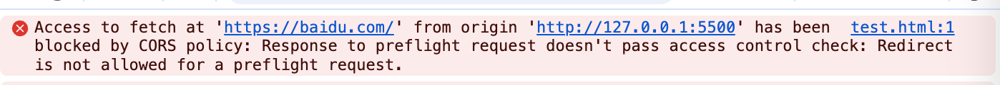
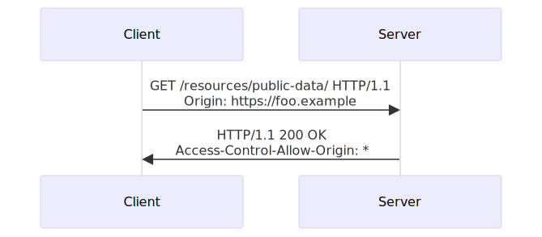
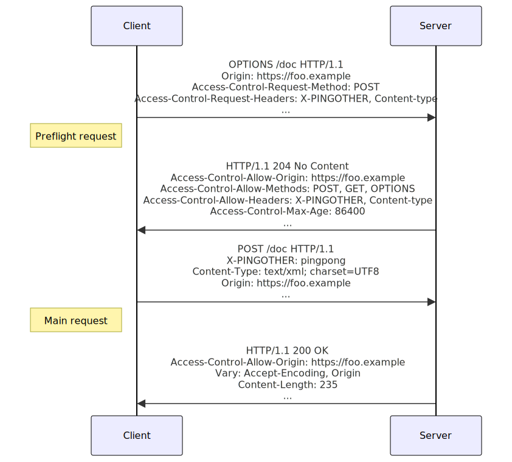
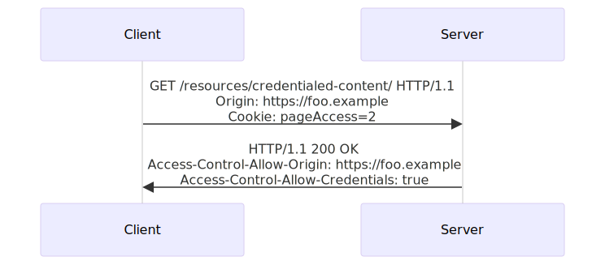
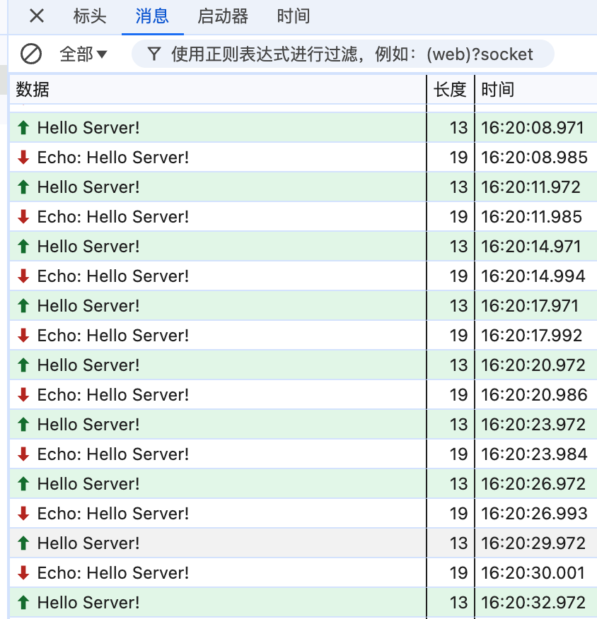

# 同源策略和跨源资源共享

### 0. 前言
在现代Web开发中，跨源问题是一个常见且重要的问题。随着前后端分离架构的普及，前端应用需要频繁地与不同源的后端服务进行交互，这就不可避免地会遇到跨源问题。



本文将详细介绍什么是同源策略、跨源问题的产生原因以及如何通过各种方法解决跨源问题。希望通过本文的讲解，读者能够深入理解同源策略的原理，并掌握解决跨源问题的实用技巧。


### 1. 同源策略和跨源
  通常我们在浏览器地址栏会输入这样的url `http://example.com:80/index.html` 来加载一个html文档。url的一部分构成了一个源。

  #### 1.1 什么是源
  > The term of origin in this context denotes the exact location of a specific resource (image, script, etc.). It consists of three main elements: the protocol (e.g., HTTP or HTTPS), the hostname (e.g., hackedu.io) and the port (80, 443, 8080, etc.).

  #### 1.2. 同源的定义和浏览器的同源策略
  **同源的定义**： 如果两个 URL 的协议、端口（如果有指定的话）和主机都相同的话，则这两个 URL 是同源的。

  由此可知值**跨源的定义**就是：两个源不同。

  **浏览器的同源策略**
  > The same-origin policy is a critical security mechanism that restricts how a document or script loaded by one origin can interact with a resource from another origin.
  同源策略是一个重要的安全策略，限制了来自某个源的文档或脚本如何与来自其他源的资源进行交互。
  强调


  **同源策略的具体解释**
  
  <span style="background-color: yellow">对同源策略的一个常见误区是认为它不允许所有的跨源资源。</span>

  同源策略控制不同源之间的交互，这些交互通常分为三类：

  1. 跨源写操作（Cross-origin writes）一般是被允许的。例如链接、重定向以及表单提交。特定少数的 HTTP 请求需要添加预检请求。
  2. 跨源资源嵌入（Cross-origin embedding）一般是被允许的。
  3. 跨源读操作（Cross-origin reads）一般是不被允许的，但常可以通过内嵌资源来巧妙的进行读取访问。例如，你可以读取嵌入图片的高度和宽度，调用内嵌脚本的方法，或得知内嵌资源的可用性。
   
  > The difference between embedding and reading a resource is that when embedded, the resource is copied from the external origin and rendered locally, while reading the resource means their origin is preserved.

  <span style="display:none">
  一些疑惑和猜测🤔
  为什么跨源写是可以的？难道浏览器只对当前用户正在访问的站点负责。其他的源不管它，就算用户提交到了恶意的东西到非同源的服务器，那是你服务器该做的东西。就算用户自己提交了自己的在本站点的信息到其他站点，我浏览器也管不着，这是用户自己的允许了行为。
  为什么跨域读是不允许的？难道浏览器只对当前用户正在访问的站点负责。其他的源来的东西我浏览器不知道有没有恶意的代码之类的。如果有的话，用户正在浏览器的站点将里面的恶意代码执行了话，用户敏感数据不久泄露了，到时候用户怪我浏览器上边，我干脆不允许用户器读取其他源的数据。
  为什么跨源资源嵌入是可以的？如果用户只是看一下其他源的东西，不读取他的数据来操作，我浏览器倒是可以让用户看一下。
  </span>

### 2. 解决跨源的方法

#### 2.1 总体的解决方案
1. 不违背同源策略。
2. 确实跨源了但是配置了cors，允许使用跨源资源。

 


#### 2.1.1 什么是cors
> Cross-Origin Resource Sharing (CORS) is an HTTP-header based mechanism that allows a server to indicate any origins (domain, scheme, or port) other than its own from which a browser should permit loading resources. 
> Additionally, for HTTP request methods that can cause side-effects on server data (in particular, HTTP methods other than GET, or POST with certain MIME types), the specification mandates that browsers "preflight" the request, soliciting supported methods from the server with the HTTP OPTIONS request method, and then, upon "approval" from the server, sending the actual request. 
> Servers can also inform clients whether "credentials" (such as Cookies and HTTP Authentication) should be sent with requests.

cors，即跨源资源共享，是一种基于http头部的机制，它允许服务器表明任何来自浏览器的、非服务器自身的源，这些源被允许加载该服务器的资源。

此外，因为`有的http请求可以对服务器的数据造成影响`，所以需要发起预检请求以便获取到服务器的证明，之后才能发起真正的请求。

服务端也会通知客户端是否应该将凭证和请求一起发送。

##### 2.1.2 跨源请求和其分类

**1.跨源请求：**
> A CORS request is an HTTP request that includes an `Origin` header. 

**2. 分类**
   1. 简单请求
   
      定义：不会触发预检请求的跨域请求。
   
      简单请求的判断规则：

      > A *simple request* is one that **meets all the following conditions**:
      >
      > - One of the allowed methods:
      >   - [`GET`](https://developer.mozilla.org/en-US/docs/Web/HTTP/Methods/GET)
      >   - [`HEAD`](https://developer.mozilla.org/en-US/docs/Web/HTTP/Methods/HEAD)
      >   - [`POST`](https://developer.mozilla.org/en-US/docs/Web/HTTP/Methods/POST)
      > - Apart from the headers automatically set by the user agent (for example, [`Connection`](https://developer.mozilla.org/en-US/docs/Web/HTTP/Headers/Connection), [`User-Agent`](https://developer.mozilla.org/en-US/docs/Web/HTTP/Headers/User-Agent), or [the other headers defined in the Fetch spec as a *forbidden header name*](https://fetch.spec.whatwg.org/#forbidden-header-name)), the only headers which are allowed to be manually set are [those which the Fetch spec defines as a CORS-safelisted request-header](https://fetch.spec.whatwg.org/#cors-safelisted-request-header), which are:
      >   - [`Accept`](https://developer.mozilla.org/en-US/docs/Web/HTTP/Headers/Accept)
      >   - [`Accept-Language`](https://developer.mozilla.org/en-US/docs/Web/HTTP/Headers/Accept-Language)
      >   - [`Content-Language`](https://developer.mozilla.org/en-US/docs/Web/HTTP/Headers/Content-Language)
      >   - [`Content-Type`](https://developer.mozilla.org/en-US/docs/Web/HTTP/Headers/Content-Type) (please note the additional requirements below)
      >   - [`Range`](https://developer.mozilla.org/en-US/docs/Web/HTTP/Headers/Range) (only with a [simple range header value](https://fetch.spec.whatwg.org/#simple-range-header-value); e.g., `bytes=256-` or `bytes=127-255`)
      > - The only type/subtype combinations allowed for the [media type](https://developer.mozilla.org/en-US/docs/Glossary/MIME_type) specified in the [`Content-Type`](https://developer.mozilla.org/en-US/docs/Web/HTTP/Headers/Content-Type) header are:
      >   - `application/x-www-form-urlencoded`
      >   - `multipart/form-data`
      >   - `text/plain`
      > - If the request is made using an [`XMLHttpRequest`](https://developer.mozilla.org/en-US/docs/Web/API/XMLHttpRequest) object, no event listeners are registered on the object returned by the [`XMLHttpRequest.upload`](https://developer.mozilla.org/en-US/docs/Web/API/XMLHttpRequest/upload) property used in the request; that is, given an [`XMLHttpRequest`](https://developer.mozilla.org/en-US/docs/Web/API/XMLHttpRequest) instance `xhr`, no code has called `xhr.upload.addEventListener()` to add an event listener to monitor the upload.
      > - No [`ReadableStream`](https://developer.mozilla.org/en-US/docs/Web/API/ReadableStream) object is used in the request.

      

      simple request and response
      ```http
      GET /resources/public-data/ HTTP/1.1
      Host: bar.other
      User-Agent: Mozilla/5.0 (Macintosh; Intel Mac OS X 10.14; rv:71.0) Gecko/20100101 Firefox/71.0
      Accept: text/html,application/xhtml+xml,application/xml;q=0.9,*/*;q=0.8
      Accept-Language: en-us,en;q=0.5
      Accept-Encoding: gzip,deflate
      Connection: keep-alive
      Origin: https://foo.example   # The request header of note is Origin, which shows that the invocation is coming from https://foo.example.

     
      HTTP/1.1 200 OK
      Date: Mon, 01 Dec 2008 00:23:53 GMT
      Server: Apache/2
      Access-Control-Allow-Origin: *  #In response, the server returns a Access-Control-Allow-Origin header with Access-Control-Allow-Origin: *, which means that the resource can be accessed by any origin.
      Keep-Alive: timeout=2, max=100
      Connection: Keep-Alive
      Transfer-Encoding: chunked
      Content-Type: application/xml

      […XML Data…]

      ```

   2. 复杂请求：
   
      定义：不是简单请求的跨源请求。一个完整的复杂请求是会发送两次请求。`先发送一次预检请求`，等服务器确认安全之后允许浏览器发出真正的请求，然后`浏览器再发出真正请求`。

      

      preflight request and response
      ```http
      OPTIONS /doc HTTP/1.1
      Host: bar.other
      User-Agent: Mozilla/5.0 (Macintosh; Intel Mac OS X 10.14; rv:71.0) Gecko/20100101 Firefox/71.0
      Accept: text/html,application/xhtml+xml,application/xml;q=0.9,*/*;q=0.8
      Accept-Language: en-us,en;q=0.5
      Accept-Encoding: gzip,deflate
      Connection: keep-alive
      Origin: https://foo.example
      Access-Control-Request-Method: POST    # The Access-Control-Request-Method header notifies the server as part of a preflight request that when the actual request is sent, it will do so with a POST request method. 
      Access-Control-Request-Headers: X-PINGOTHER, Content-Type   # The Access-Control-Request-Headers header notifies the server that when the actual request is sent, it will do so with X-PINGOTHER and Content-Type custom headers. 

      #  the actual POST request does not include the Access-Control-Request-* headers; they are needed only for the OPTIONS request.

      HTTP/1.1 204 No Content
      Date: Mon, 01 Dec 2008 01:15:39 GMT
      Server: Apache/2
      Access-Control-Allow-Origin: https://foo.example   # The server responds with Access-Control-Allow-Origin: https://foo.example, restricting access to the requesting origin domain only.  
      Access-Control-Allow-Methods: POST, GET, OPTIONS   # It also responds with Access-Control-Allow-Methods, which says that POST and GET are valid methods to query the resource in question
      Access-Control-Allow-Headers: X-PINGOTHER, Content-Type  # The server also sends Access-Control-Allow-Headers with a value of X-PINGOTHER, Content-Type, confirming that these are permitted headers to be used with the actual request. 
      Access-Control-Max-Age: 86400    # Finally, Access-Control-Max-Age gives the value in seconds for how long the response to the preflight request can be cached without sending another preflight request. 
      Vary: Accept-Encoding, Origin
      Keep-Alive: timeout=2, max=100
      Connection: Keep-Alive
      ```

      actual request and reponse
      ```http
      POST /doc HTTP/1.1
      Host: bar.other
      User-Agent: Mozilla/5.0 (Macintosh; Intel Mac OS X 10.14; rv:71.0) Gecko/20100101 Firefox/71.0
      Accept: text/html,application/xhtml+xml,application/xml;q=0.9,*/*;q=0.8
      Accept-Language: en-us,en;q=0.5
      Accept-Encoding: gzip,deflate
      Connection: keep-alive
      X-PINGOTHER: pingpong
      Content-Type: text/xml; charset=UTF-8
      Referer: https://foo.example/examples/preflightInvocation.html
      Content-Length: 55
      Origin: https://foo.example
      Pragma: no-cache
      Cache-Control: no-cache

      <person><name>Arun</name></person>

      HTTP/1.1 200 OK
      Date: Mon, 01 Dec 2008 01:15:40 GMT
      Server: Apache/2
      Access-Control-Allow-Origin: https://foo.example
      Vary: Accept-Encoding, Origin
      Content-Encoding: gzip
      Content-Length: 235
      Keep-Alive: timeout=2, max=99
      Connection: Keep-Alive
      Content-Type: text/plain

      [Some XML content]

      ```

   3. 跨域请求中的特殊情况
      <span style="display: none">
         跨域请求与重定向
         有的浏览器不允许预检请求发生重定向，而有的浏览器允许。 简单请求和实际请求是允许发生重定向。
         针对不允许预检请求发生重定向的浏览器。改前后端的接口，让服务器端不发送重定向，让前端将请求修改成简单请求。
         当预检请求不允许发生重定向的时候，可以先发送一个简单请求模拟预检请求，以便拿到预检请求的重定向地址。然后向这个重定向地址发起真正的请求。
      </span>

      1. 带credentials的跨域请求
         
         <span style="background-color: yellow">
         在跨域请求中，预检请求是不允许携带请求凭证的。实际请求中要携带凭证的话，fetch api需要将 credentials设置为‘include’，xhr需要将XMLHttpRequest.withCredentials 设置为true.
         </span>

         1. 简单请求携带credentials
            

            request and response
            
            ``` http 
            GET /resources/credentialed-content/ HTTP/1.1
            Host: bar.other
            User-Agent: Mozilla/5.0 (Macintosh; Intel Mac OS X 10.14; rv:71.0) Gecko/20100101 Firefox/71.0
            Accept: text/html,application/xhtml+xml,application/xml;q=0.9,*/*;q=0.8
            Accept-Language: en-us,en;q=0.5
            Accept-Encoding: gzip,deflate
            Connection: keep-alive
            Referer: https://foo.example/examples/credential.html
            Origin: https://foo.example
            Cookie: pageAccess=2    #  Although the request's Cookie header contains the cookie destined for the content on https://bar.other

            HTTP/1.1 200 OK
            Date: Mon, 01 Dec 2008 01:34:52 GMT
            Server: Apache/2
            Access-Control-Allow-Origin: https://foo.example
            Access-Control-Allow-Credentials: true    # if bar.other did not respond with an Access-Control-Allow-Credentials with value true, as demonstrated in this example, the response would be ignored and not made available to the web content.
            Cache-Control: no-cache
            Pragma: no-cache
            Set-Cookie: pageAccess=3; expires=Wed, 31-Dec-2008 01:34:53 GMT      # Also note that any Set-Cookie response header in a response would not set a cookie if the Access-Control-Allow-Origin value in that response is the * wildcard rather an actual origin.
            Vary: Accept-Encoding, Origin
            Content-Encoding: gzip
            Content-Length: 106
            Keep-Alive: timeout=2, max=100
            Connection: Keep-Alive
            Content-Type: text/plain

            [text/plain content]

            ```
         2. 复杂请求携带credentials
         预检请求永远不会携带credentials。复杂请求的第二次真正的请求要携带credentials的话。
         预检请求的响应头应该设置Access-Control-Allow-Credentials: true 表明实际请求可以携带credentials。
         而且预检请求的响应头上，不能指定通配符\*为`Access-Control-Allow-Origin` 、`Access-Control-Allow-Headers` 、`Access-Control-Allow-Methods`、`Access-Control-Expose-Headers`的值，需要指定精确的源、请求方法、请求请求头、响应头。

我们上面了解浏览器的同源策略和cors来实现跨域资源共享。
下面具体来看一下实际开发中会遇到什么样的场景需要解决跨域。

#### 2.2 具体的解决方案

1. 本地开发

   在本地开发当中，我们通常需要请求测试环境的接口，而本地开发html的url一般都是`localhost:8080`，测试环境的域名一般都是`a.domain.com`，域名不同确会产生跨域问题。

   我们在本地开发能发出请求，并收到服务器的返回，是因为本地有开发服务器。而服务器和服务器之间不受浏览器的同源策略影响，网页和开发服务器之间是同源的。
  
   使用vue-cli搭建vue的项目，根目录下存在vue.config.js 文件，找到该文件做如下配置。详细配置内容，点击[此处](https://cli.vuejs.org/zh/config/#devserver-proxy)去到官网查看。

   示例配置
   ```js
   module.exports = {
      devServer: {
         proxy: {
            '/api': {
            target: 'http://backendserver.com', // 目标服务器
            changeOrigin: true, // 是否改变源
            pathRewrite: { '^/api': '' }, // 重写路径
            ws: true, // 是否代理 WebSocket
            },
         },
      },
   };
   ```

2. 线上环境
   1. nginx或者后端配置cors（常用、推荐）
      
      **需求场景：**

      我们公司的有一个imsdk，甲方的很多业务都需要集成这sdk，每个业务系统分配的域名不一样嘛，然后sdk里面的请求的源是我们的服务器域名，a.domain.com。
      
      比如有一个集成方他们的一个h5要集成我们的imsdk，h5部署的服务器的域名是b.domain.com。

      所以此时发生了跨域问题。因为甲方这个是多个业务系统都有集成sdk，这些个业务系统之间他们分配到的域名都有想通的父域名，那么其实可以在后台的cors中间件设置域名白名单来维护。

      **Nginx 配置示例：**

      在 Nginx 配置文件中（例如 /etc/nginx/nginx.conf 或 /etc/nginx/conf.d/default.conf），添加以下配置：
      ```nginx
      server {
         listen 80;
         server_name a.domain.com;

         location /api/ {
            proxy_pass http://b.domain.com/api/;
            proxy_set_header Host $host;
            proxy_set_header X-Real-IP $remote_addr;
            proxy_set_header X-Forwarded-For $proxy_add_x_forwarded_for;
            proxy_set_header X-Forwarded-Proto $scheme;

            # 如果需要支持 CORS，可以添加以下头部
            add_header Access-Control-Allow-Origin 'a.domain.com';  
            add_header Access-Control-Allow-Methods 'GET, POST, OPTIONS';
            add_header Access-Control-Allow-Headers 'Origin, X-Requested-With, Content-Type, Accept, Authorization';
            add_header Access-Control-Allow-Credentials true;

            # 处理预检请求
            if ($request_method = OPTIONS) {
                  return 204;
            }
         }
      }
      ```
      <span style="background-color: yellow">
         在上面的部分已经讨论过携带credentials的请求要注意的事项。
      </span>
      
   2. nginx反向代理（常用、推荐）
      
      **需求场景：**

      我之前在乙方公司在甲方驻场的时候，有一个需求是要修改登录页的隐私政策，他们实际上是有一个登录页，但是当时甲方他们自己的登录页其实是有一个登录页的，但是是多个业务场景都公用的，没法针对我们的小程序进行修改，所以要求乙方实现登录页来修改正确的隐私条款的链接。

      实现登录页后，部署到的服务器的域名是 a.domain.com，然后甲方他们登录服务的域名是b.domain.com。所以前端直接请求登录服务的话是有跨域问题的，为了解决这个问题呢，需要一个部署在a.domain.com的代理服务器将请求转发到 b.domain.com。这个服务器不用写，使用nginx反向代理功能就可以了。      

      **Nginx 配置示例：**

      在 Nginx 配置文件中（例如 /etc/nginx/nginx.conf 或 /etc/nginx/conf.d/default.conf），添加以下配置：
      ```nginx
      server {
         listen 80;
         server_name a.domain.com;

         location /api/ {
            proxy_pass http://b.domain.com/api/;
            proxy_set_header Host $host;
            proxy_set_header X-Real-IP $remote_addr;
            proxy_set_header X-Forwarded-For $proxy_add_x_forwarded_for;
            proxy_set_header X-Forwarded-Proto $scheme;

            # 如果需要支持 CORS，可以添加以下头部
            add_header Access-Control-Allow-Origin 'a.domain.com';
            add_header Access-Control-Allow-Methods 'GET, POST, OPTIONS';
            add_header Access-Control-Allow-Headers 'Origin, X-Requested-With, Content-Type, Accept, Authorization';
            add_header Access-Control-Allow-Credentials true;

            # 处理预检请求
            if ($request_method = OPTIONS) {
                  return 204;
            }
         }
      }
      ```
   3. form 表单提交
   
      表单提交是一种传统的解决跨域问题的方法。通过表单提交，可以将数据发送到不同域的服务器，而不会受到同源策略的限制。以下是一个示例，展示如何使用表单提交来解决跨域问题。

      **需求场景：**

      甲方要求在我们登录系统里实现sso登录，使用的认证方式saml2协议。关于这个协议见[这里](https://docs.authing.co/v2/concepts/saml/saml-overview.html)。前端请求了后端的sso的登录接口之后会返回如下的响应内容。

      ```html
      <html>
        <body onload="document.forms[0].submit()">
          <form method="POST" action="https://auth.domain.com:443/auth" id="SAMLRequestForm">
            <input type="hidden" name="SAMLRequest" value="PHNhbWxwOkF1dGhuUmVxdWVzdCB4bWxuczpzYW1scD0idXJuOm9hc2l" />
            <input id="SAMLSubmitButton" type="submit" value="Submit" />
          </form>
        </body>
      </html>
      ```
      然后前端将这段内容插入到当前的文档中，浏览器会解析并且执行代码。这段代码的意思如下。
     
      当页面加载时，&lt;body&gt; 标签的 onload 事件会触发 document.forms[0].submit()。`document.forms[0].submit()`会自动提交页面中的第一个表单（即 id="SAMLRequestForm" 的表单）。

      表单提交后，页面会刷新并导航到 https://auth.domain.com:443/auth。用户不会看到表单提交的过程，因为表单是自动提交的，且包含的输入字段是隐藏的。

      `https://auth.domain.com:443/auth`这个url其实就是甲方他们的单点登录的页面。在这里登录之后（这里他们的登录系统会调用我们的后端接口），所以后面再回到我们的网站里，无需在我们的系统里输入账号密码登录了。

   4. JSONP
   
      JSONP（JSON with Padding）是一种通过 &lt;script&gt;标签来实现跨域请求的技术。由于 &lt;script&gt; 标签不受同源策略的限制，可以加载来自任何域的脚本，JSONP 利用了这一点来实现跨域数据传输。JSONP 只支持 GET 请求，并且存在一定的安全风险，因为它允许任意脚本执行。

      假设我们有一个跨域的 API 服务，返回用户信息。API 服务的 URL 是 https://api.example.com/getUser?callback=handleResponse

      **客户端示例:**

      在客户端，我们可以通过动态创建 &lt;script&gt; 标签来请求这个 API，并定义回调函数来处理响应数据。

      ```html
      <!DOCTYPE html>
      <html lang="zh-cn">
      <head>
         <meta charset="UTF-8">
         <title>JSONP 示例</title>
         <script>
            // 定义回调函数
            function handleResponse(data) {
                  console.log('用户信息:', data);
                  document.getElementById('userInfo').innerText = JSON.stringify(data, null, 2);
            }

            // 动态创建 <script> 标签
            function loadUserData() {
                  var script = document.createElement('script');
                  script.src = 'https://api.example.com/getUser?callback=handleResponse';
                  document.body.appendChild(script);
            }

            // 页面加载完成后请求数据
            window.onload = loadUserData;
         </script>
      </head>
      <body>
         <h1>JSONP 示例</h1>
         <pre id="userInfo">加载中...</pre>
      </body>
      </html>
      ```
      **服务端（API）示例:**

      服务端需要返回一个 JavaScript 函数调用，并将数据作为参数传递给这个函数。例如：
      ```js
      // 服务端返回js脚本，脚本里调用了客户端的handleResponse方法，且注入了这个接口返回的数据
      handleResponse({
         "name": "John Doe",
         "age": 30,
         "email": "john.doe@example.com"
      });
      ```
      通过这种方式，客户端可以跨域获取数据并处理。
      <span style="background-color: yellow">
         需要注意的是，JSONP只支持GET请求，且存在一定的安全风险，因为它允许任意脚本执行，因此在使用时需要谨慎。
      </span>

   5. 多域名页面间通信：
   
      1. [document.domain + iframe](https://blog.csdn.net/qq_17175013/article/details/89115629)
      2. [location.hash + iframe ](https://blog.csdn.net/qq_17175013/article/details/89115400)
      3. [window.name + iframe](https://blog.csdn.net/qq_17175013/article/details/89007334)
      4. [window.postMessage + iframe](https://blog.csdn.net/qq_17175013/article/details/89165586)
      
      <span style="background-color:yellow">这些我也没做过就不细说了，等我后面再来完善。提供了一些别人的示例代码以供参考</span>
   6. websocket
      
      因为我所在的公司做的产品是智能客服，websocket支撑起了即时通讯的功能。在工作中甲方要求我们更换新域名，域名切换之后，在测试的时候，其他的http请求都受到了跨域的问题，而websocket却是正常连接的。

      webscocket request and response
      ```http 
      GET ws://localhost:8080/ HTTP/1.1
      Host: localhost:8080
      Connection: Upgrade
      Pragma: no-cache
      Cache-Control: no-cache
      User-Agent: Mozilla/5.0 (Macintosh; Intel Mac OS X 10_15_7) AppleWebKit/537.36 (KHTML, like Gecko) Chrome/131.0.0.0 Safari/537.36
      Upgrade: websocket
      Origin: http://127.0.0.1:5500
      Sec-WebSocket-Version: 13
      Accept-Encoding: gzip, deflate, br, zstd
      Accept-Language: zh-CN,zh;q=0.9
      Sec-WebSocket-Key: 4hBbU+OKt+zg4uS0DSsmsg==
      Sec-WebSocket-Extensions: permessage-deflate; client_max_window_bits
      
      HTTP/1.1 101 Switching Protocols
      Upgrade: websocket
      Connection: Upgrade
      Sec-WebSocket-Accept: dIrsP1j1MFjHdjUbXJjdLZHfwIc=      
      ```
      

      看请求头可以知道，websocket建立连接之前需要经过http请求握手，为什么不报错，反而浏览器和服务器之间还能正常通信呢？
      
      与跨源相关的同源策略和cors都无法适用于websocket。是因为websocket使用的是`ws/wss`协议，不是http协议。虽然websocket连接建立的过程需要通过一次http握手。但是sop和cors并不会产生任何影响，因为完成WS握手不需要HTTP响应数据，之后的数据传输完全通过WebSocket协议WS/WSS进行。

      由于websocket不受sop和cors策略的影响，攻击者可能会建立跨源WS连接，并从订阅的信道发送恶意数据或接收数据，要注重websocket的安全。1. 建立websocket链接的时候最好是携带凭证。2.服务器应该验证origin头部，组织跨源的链接。

### 3. 参考

https://emrebener.medium.com/a-comprehensive-guide-to-the-same-origin-policy-and-the-cors-policy-4ca7535b0145

https://www.securityjourney.com/post/same-origin-policy-and-cross-origin-resource-sharing-cors

https://developer.mozilla.org/en-US/docs/Web/HTTP/CORS

https://developer.mozilla.org/en-US/docs/Web/Security/Same-origin_policy

https://fetch.spec.whatwg.org/#http-cors-protocol

https://dev.to/pssingh21/websockets-bypassing-sop-cors-5ajm

https://blog.securityevaluators.com/websockets-not-bound-by-cors-does-this-mean-2e7819374acc

https://www.invicti.com/white-papers/whitepaper-same-origin-policy/