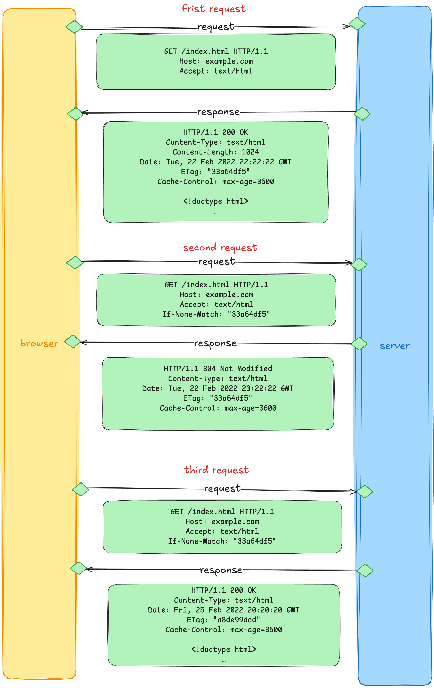

# http缓存

### 0.前言
在前端我们大概率都有遇到过这样的问题，明明刚才修改了代码，运维也帮忙部署上了，但是为啥样式没变化呢。对于一些长期不变的静态资源如果不缓存的话，那么每次都要请求，等待资源返回，是不是很麻烦么。

所以清楚浏览器的缓存策略不仅能帮我们避免问题，而且还能帮助提升应用的性能（特别`有用且重要还简单`的优化手段，效果是立竿见影，对于客户端来说响应快了，对于服务器来说压力小了。）。

### 1. http缓存的定义以及使用缓存的好处
1. **定义**
> The HTTP cache stores a response associated with a request and reuses the stored response for subsequent requests.

http缓存存储了和请求有关的响应，并且后续相同的请求将使用这个被存起来的响应。

2. **好处**
   1. <span style="background-color: yellow">不用再向服务器发出请求了。客户端和缓存之间越近，响应则会越快。</span> 很典型的一个例子就是浏览器缓存请求对应的响应。
   2. <span style="background-color: yellow">没有请求，服务器就不需要处理请求</span>——因此它不需要解析和路由请求，根据cookie恢复会话，查询数据库以获取结果，或渲染模板引擎。这减少了服务器的负载。

### 2. 缓存分类
1. **私有缓存(Private caches)**
   
   私有缓存是绑定到特定客户端的缓存——通常是浏览器缓存。私有缓存应该`存储用户的个性化响应`。与用户个人有关的缓存不要缓存到其他的缓存（非私有缓存），否则可能造成用户数据泄漏。
2. **共享缓存(Shared cache)**
   
   位于客户端和服务器之间的缓存，可以`在多个用户之间共享的缓存`。

   共享缓存再细分可以分为`代理缓存(Proxy caches)`和`管理缓存(Managed caches)`
   1. 代理缓存。
   如果和客户端和目标服务器之间经过代理，而且这个代理具有缓存的功能，但是这个代理并`不由服务提供者管理`。如果代理服务器的缓存管理策略是错误的话，那么客户端的收到的数据将有可能出错。
   2. 管理缓存。
   `托管缓存由服务开发人员明确部署`，以降低源服务器负载并有效地交付内容。示例包括反向代理、CDN 和 service worker 与缓存 API 的组合。
   
### 3. http 缓存策略
1. **缓存使用的键**
   
   <span style="background-color:yellow"> 区分不同响应一般都是基于他们的url。</span>
   

    <span style="background-color:yellow"> 有时两个请求有同样的url，但是你实际想根据一部分请求头来分别设置缓存。你应该在响应头的vary字段指明你要区分的请求头</span>
   
   

   如果应用程序使用cookie来防止其他人重用缓存的个性化内容，则应该指定Cache-Control: private，而不是设置Cookie到Vary字段里。

2. **启发式缓存。（没有使用Cache-Control进行管理）**

   <span style="background-color:yellow"> 启发式缓存的行为可能`因浏览器而异`，不同的浏览器可能会有不同的缓存策略。即使http响应头没有设置`Cache-Control`，响应依然会被缓存，在条件满足的下重用响应。</span>

   示例
   ```http
   HTTP/1.1 200 OK
   Content-Type: text/html
   Content-Length: 1024
   Date: Tue, 22 Feb 2022 22:22:22 GMT    # 响应发出的时间
   Last-Modified: Tue, 22 Feb 2021 22:22:22 GMT    # 响应的资源最近的一次修改时间

   <!doctype html>
   …

   ```
   可见上面的响应表明，这个资源已经一年没有修改了（Tue, 22 Feb 2021 22:22:22--Tue, 22 Feb 2022 22:22:22）。将会采用启发式缓存。 

   这就是启发式缓存的一个例子。启发式缓存是`Cache-Control`出现之前的一个应变方法。

   <span style="background-color:yellow">当服务器不提供任何缓存信息时，启发式缓存很有用，但当服务器更新内容的频率高于浏览器预期时，它也会导致问题。</span>

   不然就很可能遇到我在工作中遇到的问题。公司nginx的配置里边从来没有设置过Cache-Control。后来一个h5更新上了之后，由于启发式缓存的存在，导致更新没有立即生效，用户没法使用，然后投诉，产品评分降低。

   <span style="background-color:yellow">因此，建议始终为需要缓存的响应指定一个Cache-Control头。</span>

3. **基于age的缓存策略（使用Cache-Control进行管理）**
   
   通过http缓存的响应有两种状态：`fresh`和`stale`。

   fresh表明被缓存的响应合法可以被重用。
   stale表明被缓存的响应已经过期了。

   <span style="background-color: yellow">决定一个响应是fresh还是stale的衡量标准是`age`。在HTTP中，age是自响应生成以来经过的时间。</span>

   - 私有缓存示例
      ```http
      HTTP/1.1 200 OK
      Content-Type: text/html
      Content-Length: 1024
      Date: Tue, 22 Feb 2022 22:22:22 GMT
      Cache-Control: max-age=604800    # 604800 seconds is one week

      <!doctype html>
      …

      ```
      上面这个响应头里设置了Cache-Control，指定了响应的最大age为604800s。如果响应的age小于这个数表示响应处于fresh的状态；如果响应的age大于这个数表示响应处于stale状态。<span style="background-color: yellow">只要响应处于fresh的状态，他就会被用来满足客户端请求。</span>

   - 共享缓存示例
  
      如果是共享缓存的话，响应头会告知响应的age。假设一个共享缓存某天存储了一个响应，共享缓存将发送给客户端如下的响应。

      ```http
      HTTP/1.1 200 OK
      Content-Type: text/html
      Content-Length: 1024
      Date: Tue, 22 Feb 2022 22:22:22 GMT
      Cache-Control: max-age=604800
      Age: 86400

      <!doctype html>
      …
      ```
      客户端收到这个响应之后，知道了资源还剩 518400 （604800-86400）seconds保持fresh。如果响应被客户端缓存了，那么在fresh期间，客户端不会在发起请求了。

   <span style="background-color: yellow">在http 1.0版本中，响应是否fresh使用的是`Expires`来表示。</span>
   ```http
   Expires: Tue, 28 Feb 2022 22:22:22 GMT
   ```
   但其时间格式难以解析，在实现中发现了许多bug，并且有可能故意改变系统时钟，从而引发问题。
   所以在后来的http 1.1版本中使用了`max-age`来指定响应的最大经过时间，在这个时间内响应是新鲜的。

4. **验证缓存是否可以被重用**
   
   现在我们知道了缓存具有age，会处于fresh或stale的状态。

   <span style="background-color: yellow">但是stale状态的响应并不是马上就被弃用了。http还有一个机制可以将缓存从stale状态转为fresh状态。</span>
   这个机制被称之为`验证或重验证`。
   
   验证使用带有`If-Modified-Since`或者`If-None-Match`的条件请求来完成。


   1. **使用Last-Modified和If-Modified-Since**
      
      上图发生了两个请求。

      第一次响应是在22:22:22生成的，最大age为1小时，所以你知道它在23:22:22之前都是新鲜的。

      在23:22:22时，响应变得陈旧，缓存无法重用。因此，第二次发送了一个带有`If-Modified-Since`请求头的请求，以询问服务器自指定时间以来是否有任何更改。

      如果内容自指定时间以来没有改变，服务器将以304 Not Modified响应。由于此响应仅表示“无更改”，因此没有响应体——只有一个状态码——因此传输大小非常小。

      在收到响应后，客户端将存储的stale响应恢复为fresh响应，并可以在剩余的1小时内重用它。

      服务器可以从操作系统文件系统获取修改时间，这对于`提供静态文件的情况来说相对容易`。
      从数据库读取的数据作为响应返回时，通常不会自动包含 Last-Modified 字段，但可以手动设置该字段

      <span style="background-color: yellow">然而，也存在一些问题；例如，时间格式复杂且难以解析，分布式服务器难以同步文件更新时间。 为了解决这些问题，`ETag响应头被标准化作为替代方案`。</span> 
   
     
   
   2. **使用Etag和If-None-Match**（推荐）
      
      `ETag响应头的值是服务器生成的任意值`。对于服务器必须如何生成值没有限制，所以服务器可以根据他们选择的任何方式来自由设置值——例如内容体的哈希值或版本号。

      如果该响应过时了，客户端会获取缓存响应的ETag响应头的值，并将其放入`If-None- Match`请求头中，以询问服务器资源是否被修改。

      如果服务器判断请求资源的ETag首部值与请求中的`If-None-Match`值相同，则返回`304 Not Modified`。

      <span style="background-color: yellow"> 但是，如果服务器确定请求的资源现在应该具有不同的ETag值，则服务器将以`200 OK`和`最新版本的资源响应`。</span>

   注意：
   如果可能的话，RFC9110希望服务器同时发送ETag和Last-Modified作为200响应。<span style="background-color: yellow">在缓存重新验证期间，如果`if-modified-since`和`if-none-match`同时存在，则if-none-match优先于验证器。</span>如果你只考虑缓存，可能会认为Last-Modified是不必要的。然而，Last-Modified不仅对缓存有用；它是一个标准的HTTP首部，内容管理（CMS）系统也使用它来显示最后修改的时间，爬虫程序也使用它来调整爬行频率，以及其他各种用途。<span style="background-color: yellow">所以考虑到整个HTTP生态系统，最好同时提供ETag和Last-Modified。</span>

5. **响应头中Catch-Control值的含义**
   |Catch-Control的值|含义|应用场景 |
   |---|---|---|
   | no-cache | 表明在响应没有被进一步验证并且得到成功的响应之前，该响应不能用来满足任何请求| 需要确保每次请求都获取最新数据，例如动态内容。 |
   | no-store | 表示缓存不能存储直接请求或响应的任何部分，也不能使用响应来满足任何其他请求。| 敏感数据或安全性要求高的内容。 |
   | public | 响应可以被任何缓存存储，包括中间代理服务器。| 公共资源，如静态文件（CSS、JS、图片）。 |
   | private | 响应只能被单个用户的浏览器缓存，不能被共享缓存（如代理服务器）存储。| 用户特定的数据，如用户个人信息页面。 |
   | max-age=[seconds] | 当响应的的age超过指定的秒数时，就认为它是过期的。| 需要控制缓存时间的资源。|
   | s-maxage=[seconds] | 对于共享缓存，该指令指定的最大缓存时间覆盖了max-age指令或Expires首部字段指定的最大缓存时间。| 需要为共享缓存设置不同的缓存时间。 |
   | must-revalidate | 一旦响应已经过时，缓存不能重用该响应来满足另一个请求，直到源成功验证。 |确保过期内容不被使用。|
   | proxy-revalidate | 与 must-revalidate 类似，但只适用于共享缓存。| 确保代理服务器上的缓存过期后重新验证。 |
   | immutable | 表示响应内容不会改变，浏览器可以放心地使用缓存。|版本化的静态资源，如带有哈希值的文件名。|
   | stale-while-revalidate=[seconds] | 允许使用过期的缓存，同时在后台重新验证。| 版提高用户体验，减少等待时间。 |
   | stale-if-error=[seconds] | 在服务器错误时，允许使用过期的缓存。| 提高容错性，确保在服务器故障时仍能提供内容。 |


### 参考

1. https://developer.mozilla.org/en-US/docs/Web/HTTP/Caching
2. https://medium.com/nerd-for-tech/things-to-know-about-http-caching-ef0f26f9735e
3. https://hackernoon.com/the-differences-between-shared-and-private-caching
4. https://www.mnot.net/cache_docs/