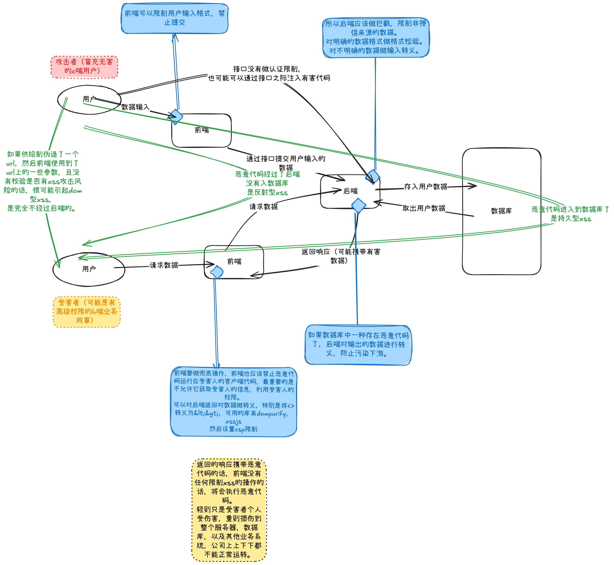

# xss攻击

### 1. 什么是xss攻击
> Cross-site scripting (XSS) is a security exploit which allows an attacker to inject into a website malicious client-side code. This code is executed by the victims and lets the attackers bypass access controls and impersonate users. According to the Open Web Application Security Project, XSS was the seventh most common Web app vulnerability in 2017.

> These attacks succeed if the Web app does not employ enough validation or encoding. The user's browser cannot detect the malicious script is untrustworthy, and so gives it access to any cookies, session tokens, or other sensitive site-specific information, or lets the malicious script rewrite the HTML content.

翻译一下:
就是你的网站的客户端代码里注入且执行了未知来源或者不被信任的恶意代码。这通常发生在对用户输入没有做足够的验证和编码情况。
⚠️ 一定要对进入系统的数据敏感，来源可能是客户端，也可能是其他的服务。

### 2. xss的注入方法和检测

**1. xss有哪些注入的方法：**
  - 在 HTML 中内嵌的文本中，恶意内容以 script 标签形成注入。
  - 在内联的 JavaScript 中，拼接的数据突破了原本的限制（字符串，变量，方法名等）。
  - 在标签属性中，恶意内容包含引号，从而突破属性值的限制，注入其他属性或者标签。
  - 在标签的 href、src 等属性中，包含 javascript: 等可执行代码。
  - 在 onload、onerror、onclick 等事件中，注入不受控制代码。
  - 在 style 属性和标签中，包含类似 background-image:url("javascript:..."); 的代码（新版本浏览器已经可以防范）。
  - 在 style 属性和标签中，包含类似 expression(...) 的 CSS 表达式代码（新版本浏览器已经可以防范）。

**2. xss的检测**
  1. 手动注入。在网站的各输入框中提交这个字符串，或者把它拼接到 URL 参数上，就可以进行检测了。
> jaVasCript:/*-/*`/*\`/*'/*"/**/(/* */oNcliCk=alert() )//%0D%0A%0d%0a//</stYle/</titLe/</teXtarEa/</scRipt/--!>\x3csVg/<sVg/oNloAd=alert()//>\x3e
>
  2. 自动扫描工具寻找 XSS 漏洞，例如 Arachni、Mozilla HTTP Observatory、w3af、strike。 
（todo：等我学了补充上这一块的知识）

### 3. xss攻击分类
XSS 攻击可以分为三类：存储（也称为持久）、反射（也称为非持久）或基于 DOM。

**存储型 XSS 攻击**

注入的攻击脚本永久的存储在目标服务器上。当浏览器发送数据请求时，，网站服务端将恶意代码从数据库取出，拼接在 HTML 中返回给浏览器。用户浏览器接收到响应后解析执行，混在其中的恶意代码也被执行。恶意代码窃取用户数据并发送到攻击者的网站，或者冒充用户的行为，调用目标网站接口执行攻击者指定的操作。

场景：比如在掘金的发文章的时候，故意文章里增加一个 script 标签，如果后台没有对文章的里内容做检查，当文章保存到数据库的时候，script 标签也被保存了。当文章发布后被其他的掘友看到，文章里的script标签被浏览器解析，其中的代码就会被执行。

这种类型的xss攻击危害挺大的，如果数据是公共的，所有读取了该系统的数据都可能受到攻击。

**反射型 XSS 攻击**

攻击者构造出特殊的 URL，其中包含恶意代码。用户打开带有恶意代码的 URL 时，网站服务端将恶意代码从 URL 中取出，拼接在 HTML 中返回给浏览器。用户浏览器接收到响应后解析执行，混在其中的恶意代码也被执行。 恶意代码窃取用户数据并发送到攻击者的网站，或者冒充用户的行为，调用目标网站接口执行攻击者指定的操作。

反射型 XSS 漏洞常见于通过 URL 传递参数的功能，如网站搜索、跳转等。

**基于 DOM 的 XSS 攻击**
其是指通过修改原始客户端脚本所使用的 DOM 环境（在受害者浏览器中）而执行的。也就是说，页面本身没有改变，但是页面中包含的客户端代码由于对 DOM 环境的恶意修改而以期望之外的方式运行。

场景：比如，我的工作中有多个业务场景需要给客户他们发送链接，期望他们打开填写个人信息。然后这些下发链接的业务场景是有区别的，所以一般去要后端设置参数的不同值来做区分。如果前端直接就拿后端传的值插入到页面中，不检验内容是否有恶意代码的话，很容易收到xss攻击的。
然后，浏览器插件和第三方库都可能导致xss攻击。

### 4. xss攻击防范

防范xss攻击的核心就是对输入和输出进行过滤。

我这里画了一张图来解释xss攻击和防范。

具体的手段有:
- 输入阶段
  - 对于明确的输入类型，例如数字、URL、电话号码、邮件地址等等内容，进行输入过滤还是必要的。
  - 限制内容长度控制。对于不受信任的输入，都应该限定一个合理的长度。虽然无法完全防止 XSS 发生，但可以增加 XSS 攻击的难度。
  - waf拦截。（todo：等我学了补充上这一块的知识）

- 输出阶段
  1. 限制执行
    - 改成纯前端渲染，把代码和数据分隔开，意思就是后端的返回里不能包含html的元素。而且注意避免 DOM 型 XSS 漏洞。
    - 使用xssjs或者dompurify等库对输出数据进行转义或者过滤。
    - 配置csp。(csp可以设置在html上也可以设置在请求头上，建议弄在请求头上，不然开发的时候很不方便。)
    - waf拦截。
  2. 限制获取敏感数据
    - HTTP-only Cookie: 禁止 JavaScript 读取某些敏感 Cookie，攻击者完成 XSS 注入后也无法窃取此 Cookie。
    - 验证码：防止脚本冒充用户提交危险操作。

### 5. 参考
https://developer.mozilla.org/en-US/docs/Glossary/Cross-site_scripting
https://developer.mozilla.org/en-US/docs/Web/HTTP/CSP
https://juejin.cn/post/6844903685122703367?searchId=202411221019020649E06AD4DD096B9647（墙裂推荐去看美团技术团队的这篇文章，比较详尽）

### 6. 其他
画图工具 https://excalidraw.com/